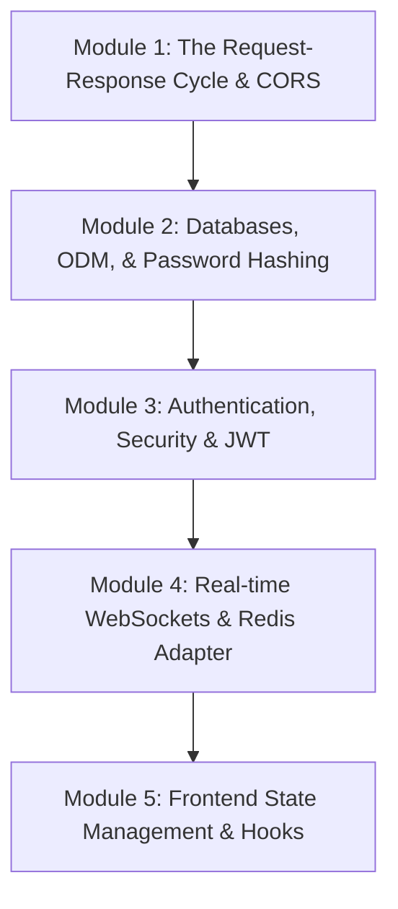

# MERN Stack Learning Hub Implementation Plan

We will create a comprehensive, vertical (requirement-to-backend) learning curriculum to transform you from a developer who "vibe codes" to one who understands how all parts of the MERN stack function, interact, and perform efficiently under the hood.

The lessons and exercises will be stored in a new folder at `d:\WebDev\Projects\call.io\learning-hub`.

---

## Proposed Curriculum & Learning Path

The course is divided into 5 vertical modules. Each module contains deep-dive conceptual markdown notes, visual architecture breakdowns, code walk-throughs of your existing `call.io` project, and a **standalone runnable demo project** to isolate and master the concept.



### Module 1: The Client-Server Connection (Request-Response, APIs, & CORS)
*   **Vertical Focus**: How the React client requests data from Express.
*   **Concepts**: 
    *   Node.js vs Express: What is a runtime vs a framework?
    *   The HTTP Protocol: Headers, Status codes (2xx, 3xx, 4xx, 5xx), Request/Response objects.
    *   Axios Interceptors: What are they and how to intercept requests/responses?
    *   CORS (Cross-Origin Resource Sharing): Why the browser blocks requests and how to resolve it safely.
*   **Code Connection**: [app.js](file:///d:/WebDev/Projects/call.io/backend/src/app.js) (Express/CORS configurations) and [client.js](file:///d:/WebDev/Projects/call.io/frontend/src/api/client.js) (Axios setup).
*   **Demo Code**: A minimal client-server pair where CORS is triggered and fixed, illustrating how JSON is transferred.

### Module 2: Data Persistence (MongoDB & Mongoose Schema Design)
*   **Vertical Focus**: Schema design, input validation, and secure password management.
*   **Concepts**:
    *   NoSQL vs SQL: Why MongoDB is used in MERN.
    *   Mongoose ODM: Schema types, validators, and custom virtual fields.
    *   Mongoose Middleware: `.pre("save")` hooks.
    *   Cryptography: Hashing passwords with `bcryptjs` and salt rounds.
*   **Code Connection**: [User.js](file:///d:/WebDev/Projects/call.io/backend/src/models/User.js).
*   **Demo Code**: A standalone CLI Node.js script that connects to MongoDB, creates schemas, hashes a password, handles validation errors, and queries users.

### Module 3: Authentication & Security (Session-less JWT)
*   **Vertical Focus**: User register, login, session retention, and route protection.
*   **Concepts**:
    *   Session-based cookie auth vs Stateless Token-based auth (JWT).
    *   JWT Structure: Header, Payload, Signature (symmetric cryptography).
    *   Protecting endpoints: How Express middleware verifies JWTs and populates `req.user`.
    *   Frontend Session: LocalStorage vs memory state, syncing axios auth headers, token expiration.
*   **Code Connection**: [authRoutes.js](file:///d:/WebDev/Projects/call.io/backend/src/routes/authRoutes.js), [authController.js](file:///d:/WebDev/Projects/call.io/backend/src/controllers/authController.js), [authMiddleware.js](file:///d:/WebDev/Projects/call.io/backend/src/middleware/authMiddleware.js), and [AuthContext.jsx](file:///d:/WebDev/Projects/call.io/frontend/src/context/AuthContext.jsx).
*   **Demo Code**: A standalone login/register endpoint system with verify token middleware.

### Module 4: Real-time Communication (Socket.io & Real-Time Events)
*   **Vertical Focus**: Real-time messaging, typing indicators, and scaling real-time traffic.
*   **Concepts**:
    *   HTTP Pull (polling) vs WebSockets (persistent TCP connection).
    *   Socket.io Event Model: custom events, `.emit()`, `.on()`, and namespaces.
    *   Rooms: How Socket.io separates connections into isolated spaces (e.g., chat rooms).
    *   Scaling WebSockets: What Redis does in a cluster adapter setup.
*   **Code Connection**: [server.js](file:///d:/WebDev/Projects/call.io/backend/src/server.js), [ChatContext.jsx](file:///d:/WebDev/Projects/call.io/frontend/src/context/ChatContext.jsx).
*   **Demo Code**: A miniature chat room socket server and HTML client showcasing bi-directional communication.

### Module 5: Modern React State & Optimization (Hooks, Context, & Refs)
*   **Vertical Focus**: How the UI reacts to changes and stays optimized.
*   **Concepts**:
    *   React State vs Component Refs (`useRef`): Why a ref is used for background tasks (e.g., tracking typing timeouts) and state for UI rendering.
    *   Context API: When to use it, why it causes re-renders, and how to optimize.
    *   Performance Hooks: `useCallback`, `useMemo` for referential stability.
*   **Code Connection**: [ChatContext.jsx](file:///d:/WebDev/Projects/call.io/frontend/src/context/ChatContext.jsx), [UserList.jsx](file:///d:/WebDev/Projects/call.io/frontend/src/components/UserList.jsx).
*   **Demo Code**: An interactive React demonstration displaying re-render behavior with and without memoization.

---

## Directory Structure of `learning-hub`

```text
d:\WebDev\Projects\call.io\learning-hub\
│
├── README.md                      <-- Syllabus and quick-start instructions
│
├── module-1-architecture\
│   ├── README.md                  <-- Explanations of Node/Express, HTTP, CORS
│   └── demo\                      <-- Runnable Express and Client demo
│       ├── package.json
│       ├── server.js
│       └── client.js
│
├── module-2-databases\
│   ├── README.md                  <-- Explanations of Mongoose, MongoDB, Hashing
│   └── demo\                      <-- Standalone mongoose script
│       ├── package.json
│       └── mongoose-demo.js
│
├── module-3-auth\
│   ├── README.md                  <-- Explanations of JWT, Middleware, Frontend Context
│   └── demo\                      <-- Auth server + client script
│       ├── package.json
│       ├── server.js
│       └── client.js
│
├── module-4-sockets\
│   ├── README.md                  <-- Explanations of WebSockets, Socket.io, Redis scaling
│   └── demo\                      <-- WebSocket server + client UI
│       ├── package.json
│       ├── server.js
│       └── index.html
│
└── module-5-react\
    ├── README.md                  <-- Explanations of React State, Refs, Context, and Performance
    └── demo\                      <-- React rendering demo component
        ├── package.json
        ├── index.html
        └── App.jsx
```

---

## Verification Plan

To verify that the code and materials are ready and run correctly:
1. We will verify that each demo is fully self-contained (has its own `package.json` with appropriate scripts and dependencies).
2. We will check that instructions in individual files are crystal-clear and beginner-friendly.
3. We will write scripts that are easy to run (e.g., `npm install` and `npm run start`).
